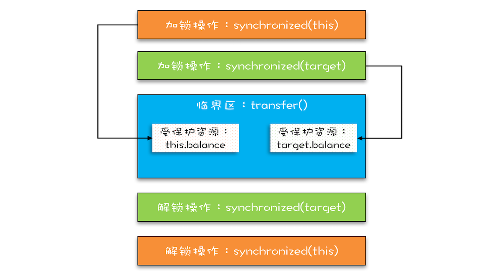
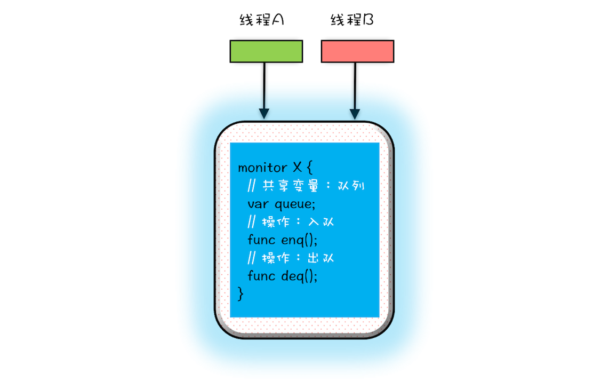
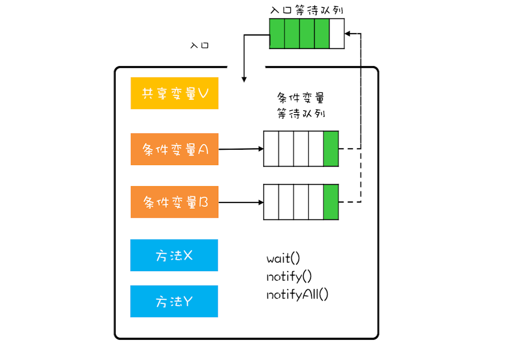

# Java 并发编程

<br />

<br />

## 01 | 可见性、原子性和有序性问题：并发编程Bug的源头

### 幕后故事

CPU、内存、IO 设备三者速度存在差异

为了利用 CPU 的高性能，计算机体系结构、操作系统、编译程序都做出了贡献：

1. CPU 增加缓存 -> CPU 与内存
2. 操作系统增加进程、线程，以分时复用 CPU，-> CPU 与 IO
3. 编译程序优化指令 -> 缓存

### 1. 可见性

**可见性**：一个线程对共享变量的修改，另外一个线程能够立刻看到

多核时代 -> 硬件程序员给软件程序员挖的“坑”


### 2. 原子性

**原子性**：一个或多个操作在 CPU 中不被中断的特性

**时间片、分时复用**

早期 -> 进程 -> 不共享内存 -> 成本高

现代 -> 线程 -> 共享内存 -> 成本低

“任务切换” === “线程切换”

Java 并发程序，多线程

count += 1：

1. count 从内存加载到 CPU 寄存器
2. 寄存器中 + 1
3. 写入内存（CPU 缓存）

违背直觉：原子操作是 CPU 指令级别，而不是高级语言

### 3. 有序性

经典案例：单例 -> 双重检查

```java
public class Singleton {
  static final volatile Singleton instance;
  
  static Singleton getInstance() {
    if (instance == null) {
      synchronized(Singleton.class) {
        if (instance == null)
          instance = new Singleton();
        }
    }
    
    return instance;
  }
}
```

new 操作次序：

1. 分配内存 M
2. M 上初始化 instance 对象
3. instance = M 地址

->

1. 分配内存 M
2. instance = M 地址
3. M 上初始化 instance 对象

### 总结

缓存 -> 可见性

线程切换 -> 原子性

编译优化 -> 有序性

采用一项技术的同时，带来的问题，规避

<br />

<br />


## 02 | Java内存模型：看Java如何解决可见性和有序性问题

缓存 -> 可见性

编译优化 -> 有序性

**按需禁用缓存和编译优化** ->

Java 内存模型：

- 程序员视角 -> JVM 如何提供按需禁用缓存和编译优化的方法 
- （volatile synchronzied final） + 6 项 Happens-Before 规则

### 使用 volatile 的困惑

```java
class VolatileExample {
  int x = 0;
  volatile boolean v = false;
  
  public void writer() {
    x = 42;
    v = true;
  }
  
  public void reader() {
    if (v == true) {
      // 这里 x 会是多少呢？
    }
  }
}
```

### Happens-Before 规则

Happens-Before：**前一个操作结果对后续操作可见**，约束编译优化

晦涩，程序员相关，6项：

1. 程序顺序性规则

   前面 Happens-Before 后续

2. volatile 变量规则

   对 volatile 变量的写，Happens-Before 后续对该变量的读

3. 传递性

   （A Happens-Before B，B Happens-Before A） -> A Happens-Before C 

   

4. 管程中锁的规则

   对锁的解锁，Happens-Before 后续对该锁的加锁

   **管程**：1 种通用的同步原语，Java -> synchronized 隐式实现

5. 线程 start() 规则

   主线程 A 启动子线程 B 后，B 能看到 A 之前的操作

6. 线程 join() 规则

   主线程 A 等待子线程 B 完成，当 B 完成后（ A 中 join() 方法返回），A 能够看到 B 对共享变量 的操作

### 被忽视的 final

加强编译器优化 -> 构造函数没有“逸出”

### 总结

Java 内存模型：并发编程领域的重要创新，2 部分（应用开发 + JVM 开发）

Happens-Before： 1 种因果关系，本质上是可见性

<br />

<br />

## 03 | 互斥锁（上）：解决原子性问题

### 如何解决原子性问题？

原子性 -> 线程切换 -> CPU 中断 ->

- 单核 -> 原子性
- 多核 -> 不能保证"**同 1 时刻只有 1 个线程执行（互斥）**"

### 用 synchronized 解决 count += 1 问题

```java
class SafeCalc {
  long value = 0L;
  
  synchronized long get() {
    return value;
  }
  
  synchronized void addOne() {
    value += 1;
  }
}
```


门票管理：

- 门票 -> 锁
- 座位 -> 首保护资源
- 检票口 -> xx()

### 锁和受保护资源关系（1 ：N）

*“包场”*

### 总结

不是随便 1 把锁都有效，需要考虑：

- 锁定对象
- 保护的资源
- 访问路径（xxx()）

<br />

<br />

## 04 | 互斥锁（下）：如何用一把锁保护多个资源？

### 没有关联关系

- **细粒度锁**
- 1 把锁 -> 串行

### 有关联关系

```java
class Account {
  private int balance;
  
  synchronized void transfer(
      Account target, int amt){
    if (this.balance > amt) {
      this.balance -= amt;
      target.balance += amt;
    }
  } 
}
```


### 使用锁的正确姿势

*“包场”* -> **锁能覆盖所有受保护资源** -> Xx.class

### 总结

关联关系 -> “原子性”特征 -> 面向高级语言

”**原子性**“ ->

- 外在表现：不可分割
- 本质：**中间状态对外不可见**

<br />

<br />

## 05 | 一不小心就死锁了，怎么办？

### 向现实世界要答案



### 没有免费的午餐

细粒度锁 -> 性能优化手段 -> 可能导致死锁


死锁：1 组互相竞争资源的线程因互相等待，导致“永久”阻塞的现象

```java
class Account {
  private int balance;

  void transfer(Account target, int amt) {
    // 锁定转出账户
    synchronized(this) {     ①
      // 锁定转入账户
      synchronized(target) { ②
        if (this.balance > amt) {
          this.balance -= amt;
          target.balance += amt;
        }
      }
    }
  } 
}
```


### 如何预防死锁

Coffman 死锁 4 条件：

1. ~~互斥~~
2. 占有且等待 -> 1 次性申请所有
3. 不可抢占 -> 主动释放
4. 循环等待 -> 按次序申请 

### 占有且等待


```java
class Allocator {
  private List<Object> als = new ArrayList<>();
  
  // 一次性申请所有资源
  synchronized boolean apply(Object from, Object to) {
    if(als.contains(from) || als.contains(to)) {
      return false;  
    } else {
      als.add(from);
      als.add(to);  
    }
    
    return true;
  }
  
  // 归还资源
  synchronized void free(Object from, Object to) {
    als.remove(from);
    als.remove(to);
  }
}

class Account {
  // actr 应该为单例
  private Allocator actr;
  private int balance;

  void transfer(Account target, int amt) {
    // 一次性申请转出账户和转入账户，直到成功
    while(!actr.apply(this, target))
      ；
      
    try {
      // 锁定转出账户
      synchronized(this) {              
        // 锁定转入账户
        synchronized(target) {           
          if (this.balance > amt) {
            this.balance -= amt;
            target.balance += amt;
          }
        }
      }
    } finally {
      actr.free(this, target)
    }
  } 
}
```

### 不可抢占

~~synchronized~~：直接进入阻塞，无法释放资源 ->

java.util.concurrent.Lock

### 循环等待

```java
class Account {
  private int id;
  private int balance;
  
  void transfer(Account target, int amt) {
    Account left = this        ①
    Account right = target;    ②
    if (this.id > target.id) { ③
      left = target;           ④
      right = this;            ⑤
    }                          ⑥
      
    // 锁定序号小的账户
    synchronized(left) {
      // 锁定序号大的账户
      synchronized(right) { 
        if (this.balance > amt) {
          this.balance -= amt;
          target.balance += amt;
        }
      }
    }
  } 
}
```

### 总结

利用现实世界模型 -> 解决方案 -> 更容易理解，看清本质

现实世界（智能） VS 编程世界 -> 仔细对比个角色间差异

细粒度锁定多个资源 -> 死锁 -> 识别出风险很重要

成本：占用且等待 > 循环等待 -> 评估成本，选择成本最低方案

<br />

<br />

## 06 | 用“等待-通知”机制优化循环等待

**等待 - 通知机制**

### 完美的就医流程

就医流程 -> 等待 - 通知机制：

- 获取互斥锁，当条件不满足，释放互斥锁，进入等待状态
- 当条件满足，通知等待的线程，重新获取互斥锁

### 用 synchronized 实现等待 - 通知机制


- notify() 通知时间点和执行时间点基本不重合 -> **条件曾经满足**
- 需要重新获取互斥锁（wai() 释放）
- 获取了互斥锁 -> wait()、notify()、notifyAll() 被调用

### 小试牛刀：1 个更好的资源分配器

4 个要素：

1. 互斥锁
2. 条件
3. 等待
4. 通知

```java
  while(条件不满足) {
    wait();
  }
```

**条件曾经满足** -> 这种范式（经典做法）

```java
class Allocator {
  private List<Object> als;
  // 一次性申请所有资源
  synchronized void apply(Object from, Object to) {
    // 经典写法
    while (als.contains(from) || als.contains(to)) {
      try {
        wait();
      } catch (Exception e) {
      }   
    } 
    als.add(from);
    als.add(to);  
  }
  // 归还资源
  synchronized void free(Object from, Object to) {
    als.remove(from);
    als.remove(to);
    notifyAll();
  }
}
```

### 尽量用notifyAll()

可能导致某些线程永远不会被通知

### 总结

轮询 -> 等待 - 通知机制 -> 管程

<br />

<br />

## 07 | 安全性、活跃性以及性能问题

- 安全性
- 活跃性
- 性能

### 安全性

线程安全 -> 正确性：程序按照期望执行 ->原子性、有序性、可见性

**数据竞争**（Data Race）：共享数据 + 同时写

```java
public class Test {
  private long count = 0;
  
  synchronized long get() {
    return count；
  }
  
  synchronized void set(long v) {
    count = v;
  } 
  
  void add10K() {
    int idx = 0;
    while (idx++ < 10000) {
      set(get() + 1)      
    }
  }
}
```

**竞态条件**（Race Condiction）：执行结果依赖线程执行顺序

线程执行顺序不确定 -> 结果不确定 -> Bug.

```java
if (状态变量 满足 执行条件) {
  执行操作
}
```

例子中，set(get() + 1)  隐式依赖 get()

数据竞争 + 竞态条件 -> 互斥 -> CPU、操作系统、编程语言 -> 锁

### 活跃性

某个操作无法执行下去

- 死锁

- 活锁 -> 等待随机时间 -> 分布式一致性算法 Raft

- 饥饿 -> “不患寡，而患不均”

  - CPU 繁忙
  - 执行时间长

  1. ~~资源充足~~
  2. 公平分配 -> 公平锁
  3. ~~避免长时间~~

### 性能

JDK SDK 并发包 -> 提升某个特定领域性能

1. 无锁算法和数据结构：TLS、COW、乐观锁、原子类、Disropter..
2. 减少锁的持有时间：细粒度锁（ConcurrentHashMap 分段锁）、读写锁..

指标：

- 吞吐
- 延迟
- 并发量

### 总结

微观：

- 可见性
- 原子性

- 可见性

宏观：

- 安全性
- 活跃性
- 性能

设计并发程序 -> 宏观

遇到问题 -> 分析清楚 -> 微观

性能 -> 并发程序 -> 安全性 -> 锁 -> 串行（性能）..

<br />

<br />

## 08 | 管程：并发编程的万能钥匙

管程 -> 万能钥匙：

- < JDK 1.5：唯 1 并发原语
- &gt;= JDK 1.5：SDK并发包，以此为基础

### 什么是管程

管程和信号量等价 -> 管程能实现信号量，信号量能实现管程

管程更容易使用 -> Java 选择.

Monitor -> 意译 -> 管程

**管程：管理共享变量及对共享变量的操作过程，让他们支持并发** ->

管理类的成员变量和成员方法，让该类线程安全

### MESA 模型

- Hasen
- Hoare
- MESA

并发编程领域 2 大核心问题：

1. 互斥
2. 同步

互斥：



同步：



```java
public class BlockedQueue<T>{
  final Lock lock = new ReentrantLock();
  // 条件变量：队列不满  
  final Condition notFull = lock.newCondition();
  // 条件变量：队列不空  
  final Condition notEmpty = lock.newCondition();

  // 入队
  void enq(T x) {
    lock.lock();
    try {
      while (队列已满) {
        // 等待队列不满 
        notFull.await();
      }  
      
      // 省略入队操作...
      // 入队后, 通知可出队
      notEmpty.signal();
    }finally {
      lock.unlock();
    }
  }
  
  // 出队
  void deq() {
    lock.lock();
    try {
      while (队列已空) {
        // 等待队列不空
        notEmpty.await();
      }
      
      // 省略出队操作...
      // 出队后，通知可入队
      notFull.signal();
    }finally {
      lock.unlock();
    }  
  }
}
```

### wait() 的正确姿势

编程范式，MESA 特有

```java
while (条件不满足) {
  wait();
}
```

条件满足后：

- Hasen：T2 通知 T1 -> T2 结束 -> T1 执行

  notify() 放最后

- Hoare：T2 通知 T1 -> T2 阻塞 -> T1 执行完 -> T2 执行

  多 1 次唤醒

- MESA：T2 通知 T1 -> T1 入条件队列

  T1 曾经满足条件 -> while() 检验

notify() 何时可以使用

1. 等待条件相同
2. 唤醒后执行操作相同
3. 只需要唤醒 1 个线程

eg：

1. **while() 等待条件完全相同**

```java
while (队列已满) {
  // 等待队列不满
  notFull.await();
}
```

2. 唤醒后执行操作相同

```java
// 省略入队操作...
// 入队后, 通知可出队
notEmpty.signal();
```

3. 满足

### 总结

synchronized：1 个条件，自动

Lock：>= 1 个条件，手动

管程 -> 万能钥匙