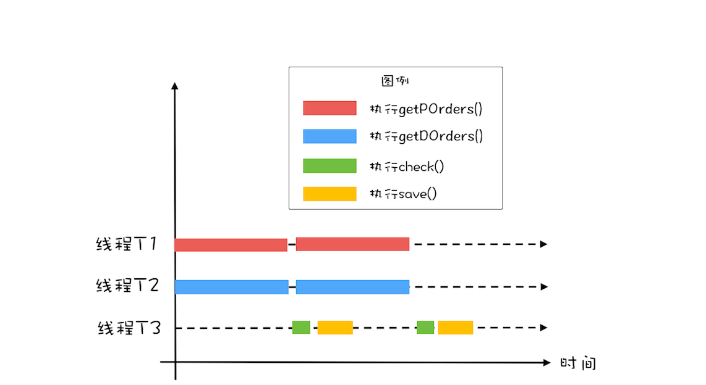

Java 并发编程 - 2

<br />

<br />

##09 | Java线程（上）：Java线程的生命周期

### 通用的线程生命周期

初始状态、可运行状态、运行状态、休眠状态、终止状态


### Java 中线程生命周期

6 中状态：

1. NEW
2. RUNNABLE（IO..）
3. BLOCKED
4. WAITING
5. TIME_WAITING
6. TERMINATED

BLOCKED、WAITING、TIME_WAITING -> 休眠状态 -> 没有 CPU 使用权


- RUNNABLE -> BLOCKED：synchronized 隐式锁
- RUNNABLE -> WAITING：
  - Object.wait()
  - Thread.join()
  - LockSupport.part()
- RUNNABLE -> TIME_WAITING：
  - Object.wait(long timeout)
  - Thread.join(long millis)
  - LockSupport.partNanos(Object blocker, long deadline)
  - LockSupport.partUnits(long deadline)
  - Thread.sleep(long millis)
- NEW -> RUNNABLE：.start()
- RUNNABLE -> TERIMNATED：
  - run()
  - run() 异常
  - interrupt() 通知
    - 异常
      - WAITING、TIME_WAITING -> InterruptedException
      - RUNNABLE
        - java.nio.channels.InterruptibleChannel -> java.nio.channels.ClosedByInterruptException
        - java.nio.channels.Selector -> 直接返回
    - 主动检测
    - isInterrupted()

### 总结

利于诊断多线程 Bug，日志，多线程 dump

jstack，Java VisualVM

<br />

<br />

##10 | Java线程（中）：创建多少线程才是合适的？

### 为什么要使用多线程？

性能 -> 延迟、吞吐量

### 多线程的应用场景

- 优化算法

- 将硬件性能发挥到极致 -> I / O 利用率、CPU 利用率 -> 

  操作系统 -> 磁盘、网卡、CPU 利用率 -> 单一 ->

  I / O  和 CPU 综合利用率 -> 多线程

### 多少线程合适？

- CPU 密集型：CPU 核数 + 1
- I / O 密集型：CPU 核数 * [ 1 +（I/O 耗时 / CPU 耗时）]

### 总结

1 个原则：将硬件性能发挥到极致

动态 -> 估算参数 -> 压测

<br />

<br />

## 11 | Java线程（下）：为什么局部变量是线程安全的？

```java
int[] fibonacci(int n) {
  int[] r = new int[n];
  r[0] = r[1] = 1;  // ①
  for(int i = 2; i < n; i++) {
      r[i] = r[i-2] + r[i-1];
  }
  return r;
}
```

CPU 没有方法概念，1 条条指令

方法如何被执行

```java
int a = 7；
int[] b = fibonacci(a);
int[] c = b;
```


**堆栈寄存器**、**栈帧**


### 线程与调用栈

每个线程有独立调用栈


### 线程封闭

仅在单线程内访问数据

eg：JDBC Connection

### 总结

推断 -> 源码验证

原理性、通用 -> 具体技术.

<br />

<br />

## 12 | 如何用面向对象思想写好并发程序？

在 Java 里，面向对象思想让并发编程变得更简单

- 封装共享变量
- 识别共享变量间约束条件
- 制定并发访问策略

### 一、封装共享变量

将共享变量作为属性封装在内部，对所有公共方法制定并发访问策略

不会发生变化的共享变量 -> final

### 二、识别共享变量间约束条件

非常重要，**约束条件决定了并发访问策略**

if 语句，就应该意识到可能存在竞态条件

```java
public class SafeWM {
  // 库存上限
  private final AtomicLong upper = new AtomicLong(0);
  // 库存下限
  private final AtomicLong lower = new AtomicLong(0);
  
  // 设置库存上限
  synchronized void setUpper(long v) {
    // 检查参数合法性
    if (v < lower.get()) {
      throw new IllegalArgumentException();
    }
    upper.set(v);
  }
  
  // 设置库存下限
  synchronized void setLower(long v) {
    // 检查参数合法性
    if (v > upper.get()) {
      throw new IllegalArgumentException();
    }
    lower.set(v);
  }
  // 省略其他业务代码
}
```


### 三、制定并发访问策略

非常复杂，整个专栏都是在尝试搞定它

3 个方案：

1. 不变模式：Java 少，其他，eg：Actor 模式，CSP 模式，函数式编程.
2. 避免共享：
3. 管程及其他同步工具：管程（万能），特定场景 -> 读写锁、并发容器等同步工具

3 个宏观原则：

1. 优先使用成熟工具类：“~~发明轮子~~”
2. 迫不得已才使用低级原语：synchronzied、Lock、Semaphore -> 实际上没有感觉上简单，慎重.
3. 避免过早优化

<br />

<br />

## 13 | 理论基础模块热点问题答疑


- 锁：**私有、不可变、不可重用**

- 锁的性能要看场景

- 方法调用先计算参数

- InterruptedException 异常处理需小心 -> 中断清除标志位

- 理论值 or 经验值

### 总结

- 内容 -> 理论 -> 思路、方法

- 思考 -> 细节 -> 实践

《Java 安全编码标准》

学好理论有思路，关注细节定成败

<br />

<br />

## 14 | Lock和Condition（上）：隐藏在并发包中的管程

- Lock -> 互斥

- Condiction -> 互斥

```java
// 支持中断的 API
void lockInterruptibly() 
  throws InterruptedException;

// 支持超时的 API
boolean tryLock(long time, TimeUnit unit) 
  throws InterruptedException;

// 支持非阻塞获取锁的 API
boolean tryLock();
```

### 如何保证可见性

```java
class X {
  private final Lock rtl = new ReentrantLock();
  int value;
  
  public void addOne() {
    // 获取锁
    rtl.lock();  
    try {
      value+=1;
    } finally {
      // 保证锁能释放
      rtl.unlock();
    }
  }
}
```

利用了 volatile 相关的 Happens-Before 规则：

1. 顺序性
2. volatile 变量
3. 传递性

- 获取锁 -> 读写 state 值
- 释放锁 -> 读写 state 值

```java
class SampleLock {
  volatile int state;
  
  // 加锁
  lock() {
    // 省略代码无数
    state = 1;
  }
  
  // 解锁
  unlock() {
    // 省略代码无数
    state = 0;
  }
}
```

### 可重入锁

ReentrantLock

- 可重入锁：线程可以重复获取同 1 把锁
- 可重入函数：多个线程可以同时调用该函数（线程安全）

### 公平锁和非公平锁

### 锁的最佳实践

Doug Lea《Java 并发编程：设计原则与模式》，3 个最佳实践：

1. 永远只在更新对象的成员变量时加锁
2. 永远只在访问可变的成员变量时加锁
3. 永远不在调用其他对象的方法时加锁 -> ~~sleep()、I / O~~

并发问题，难以诊断，代码尽量安全，尽量简单，哪怕只要有 1 点可能会出问题，都要努力避免

### 总结

Lock 接口每个方法，深思熟虑

可中断、超时、非阻塞 -> 安全、健壮

- 3 个最佳实践
- 减少持有锁时间
- 减小锁粒度

<br />

<br />

## 15 | Lock和Condition（下）：Dubbo如何用管程实现异步转同步？

Condiction：实现了管程模型中的条件变量

阻塞队列 -> 2 个条件变量

### 同步和异步

- 同步：调用方需要等待结果
- 异步：调用方不需要等待结果
  - 异步调用：调用方创建线程
  - 异步方法：方法实现中创建线程

Dubbo 源码分析

异步：TCP


```java
// 创建锁与条件变量
private final Lock lock = new ReentrantLock();
private final Condition done = lock.newCondition();

// 调用方通过该方法等待结果
Object get(int timeout) {
  long start = System.nanoTime();
  
  lock.lock()
  try {
	while (!isDone()) {
	  done.await(timeout);
    long cur = System.nanoTime();
	  if (isDone() || cur-start > timeout) {
	    break;
	  }
	}
  } finally {
	lock.unlock();
  }
  
  if (!isDone()) {
	throw new TimeoutException();
  }
  
  return returnFromResponse();
}

// RPC 结果是否已经返回
boolean isDone() {
  return response != null;
}

// RPC 结果返回时调用该方法   
private void doReceived(Response res) {
  lock.lock();
  try {
    response = res;
    if (done != null) {
      done.signal();
    }
  } finally {
    lock.unlock();
  }
}
```

<br />

<br />

## 16 | Semaphore：如何快速实现一个限流器？

Semaphore：信号量｜信号灯

Dijkstra 1965

### 信号量模型

1 个计数器 + 1 个等待队列 + 3 个方法（原子性）


- init()：计数器初始值
- down()：- 1，< 0，阻塞
- up()：+ 1，<= 0，唤醒等待队列中 1 线程并移除

java.util.concurrent.Semaphore

```java
class Semaphore{
  // 计数器
  int count;
  // 等待队列
  Queue queue;
  
  // 初始化操作
  Semaphore(int c) {
    this.count=c;
  }
  
  void down() {
    this.count--;
    if (this.count<0) {
      // 将当前线程插入等待队列
      // 阻塞当前线程
    }
  }
  
  void up() {
    this.count++;
    if (this.count<=0) {
      // 移除等待队列中的某个线程 T
      // 唤醒线程 T
    }
  }
}
```

down()、up() -> P 操作、V 操作 -> PV 原语 -> Java -> acquire()、release()

### 如何使用信号量

```java
static int count;
// 初始化信号量
static final Semaphore s = new Semaphore(1);

// 用信号量保证互斥    
static void addOne() {
  s.acquire();
  try {
    count+=1;
  } finally {
    s.release();
  }
}
```

### 快速实现 1 个限流器

Lock 不容易实现 -> **Semaphore 可以允许 N 个线程访问 1 个临界区**

各种池化资源

```java
class ObjPool<T, R> {
  final List<T> pool;
  // 用信号量实现限流器
  final Semaphore sem;
  
  // 构造函数
  ObjPool(int size, T t) {
    pool = new Vector<T>();
    for (int i=0; i<size; i++) { 
      pool.add(t);
    }
    sem = new Semaphore(size);
  }
  
  // 利用对象池的对象，调用 func
  R exec(Function<T,R> func) {
    T t = null;
    sem.acquire();
    try {
      t = pool.remove(0);
      return func.apply(t);
    } finally {
      pool.add(t);
      sem.release();
    }
  }
}

// 创建对象池
ObjPool<Long, String> pool = new ObjPool<Long, String>(10, 2);
// 通过对象池获取 t，之后执行  
pool.exec(t -> {
    System.out.println(t);
    return t.toString();
});
```

### 总结

信号量在 Java 名气不大，其他语言较有知名度

管程模型 -> 易用性、工程系

<br />

<br />

## 17 | ReadWriteLock：如何快速实现一个完备的缓存？

分场景优化性能，提升易用性

### 读写锁

1. N 个线程读
2. 1 个线程写
3. 如果有线程正在写，禁止读

### 快速实现 1 个缓存

```java
class Cache<K,V> {
  final Map<K, V> m = new HashMap<>();
  final ReadWriteLock rwl = new ReentrantReadWriteLock();
  final Lock r = rwl.readLock();
  final Lock w = rwl.writeLock();
  
  // 读缓存
  V get(K key) {
    r.lock();
    try { return m.get(key); }
    finally { r.unlock(); }
  }
  
  // 写缓存
  V put(K key, V value) {
    w.lock();
    try { return m.put(key, v); }
    finally { w.unlock(); }
  }
}
```

使用缓存首先要解决数据初始化

- 1 次性加载
- 懒加载


### 实现懒加载

```java
class Cache<K,V> {
  final Map<K, V> m = new HashMap<>();
  final ReadWriteLock rwl = new ReentrantReadWriteLock();
  final Lock r = rwl.readLock();
  final Lock w = rwl.writeLock();
 
  V get(K key) {
    V v = null;
    // 读缓存
    r.lock();         ①
    try {
      v = m.get(key); ②
    } finally{
      r.unlock();     ③
    }
    
    // 缓存中存在，返回
    if(v != null) {   ④
      return v;
    }  
    
    // 缓存中不存在，查询数据库
    w.lock();         ⑤
    try {
      // 再次验证
      // 其他线程可能已经查询过数据库
      v = m.get(key); ⑥
      if(v == null){  ⑦
        // 查询数据库
        v= 省略代码无数
        m.put(key, v);
      }
    } finally{
      w.unlock();
    }
    
    return v; 
  }
}
```

### 读写锁的升级和降级

### 总结

超时机制.

<br />

<br />

## 18 | StampedLock：有没有比读写锁更快的锁？

StampedLock 支持的 3 种锁模式

- 写
- -悲观读锁
- 乐观读：**无锁的**，允许 1 个线程获取写锁

升级为悲观读锁，代码简练且不易出错

StampedLock 读模版

```java
final StampedLock sl = new StampedLock();

// 乐观读
long stamp = sl.tryOptimisticRead();
// 读入方法局部变量
......
// 校验 stamp
if (!sl.validate(stamp)) {
  // 升级为悲观读锁
  stamp = sl.readLock();
  try {
    // 读入方法局部变量
    .....
  } finally {
    // 释放悲观读锁
    sl.unlockRead(stamp);
  }
}
// 使用方法局部变量执行业务操作
......
```

StampedLock 写模版

```java
long stamp = sl.writeLock();
try {
  // 写共享变量
  ......
} finally {
  sl.unlockWrite(stamp);
}
```

### 进一步理解乐观锁

```sql
select id，... ，version
from product_doc
where id=777
```

```sql
update product_doc 
set version=version+1，...
where id=777 and version=9
```

version 类似 StampedLock 中 stamp

### StampedLock 注意事项

- ReentrantLock 子集
- 不支持重入
- 写、悲观读不支持条件变量
- 100% CPU

<br />

<br />

## 19 | CountDownLatch和CyclicBarrier：如何让多线程步调一致？


### 利用并行优化对账系统

```java
while(存在未对账订单){
  // 查询未对账订单
  Thread T1 = new Thread(() -> {
    pos = getPOrders();
  });
  T1.start();
  
  // 查询派送单
  Thread T2 = new Thread(() -> {
    dos = getDOrders();
  });
  T2.start();
  
  // 等待 T1、T2 结束
  T1.join();
  T2.join();
  // 执行对账操作
  diff = check(pos, dos);
  // 差异写入差异库
  save(diff);
} 
```

### 用 CountDownLatch 实现线程等待

```java
// 创建 2 个线程的线程池
Executor executor = Executors.newFixedThreadPool(2);

while(存在未对账订单){
  // 计数器初始化为 2
  CountDownLatch latch = new CountDownLatch(2);
  
  // 查询未对账订单
  executor.execute(() -> {
    pos = getPOrders();
    latch.countDown();
  });
  // 查询派送单
  executor.execute(() -> {
    dos = getDOrders();
    latch.countDown();
  });
  
  // 等待两个查询操作结束
  latch.await();
  // 执行对账操作
  diff = check(pos, dos);
  // 差异写入差异库
  save(diff);
}
```

### 进一步优化性能




用 CyclicBarrier 实现线程同步

```java
// 订单队列
Vector<P> pos;
// 派送单队列
Vector<D> dos;
// 执行回调的线程池 
Executor executor = Executors.newFixedThreadPool(1);
final CyclicBarrier barrier = new CyclicBarrier(2, () -> {
    executor.execute(() -> check());
});
  
void check() {
  P p = pos.remove(0);
  D d = dos.remove(0);
  // 执行对账操作
  diff = check(p, d);
  // 差异写入差异库
  save(diff);
}
  
void checkAll() {
  // 循环查询订单库
  Thread T1 = new Thread(() -> {
    while (存在未对账订单) {
      // 查询订单库
      pos.add(getPOrders());
      // 等待
      barrier.await();
    }
  });
  T1.start();  
  
  // 循环查询运单库
  Thread T2 = new Thread(() -> {
    while (存在未对账订单) {
      // 查询运单库
      dos.add(getDOrders());
      // 等待
      barrier.await();
    }
  });
  T2.start();
}
```

### 总结

- CountDownLatch：1 个线程等待 N 个线程 -> 团长等待所有游客
- CylicBarrier：N 个线程间互相等待 -> 驴友之间不离不弃
  - 计数器可以循环利用
  - 重置
  - 设置回调函数

<br />

<br />

## 20 | 并发容器：都有哪些“坑”需要我们填？

### 同步容器及其注意事项

Java 容器：

- List
- Map
- Set
- Queue

Collections.synchronizedXx(new Xxx())

- 组合操作 -> 竞态条件
- 迭代器遍历 -> “坑”

```java
List list = Collections.synchronizedList(new ArrayList());
synchronized (list) {  
  Iterator i = list.iterator(); 
  while (i.hasNext())
    foo(i.next());
}    
```

### 并发容器及其注意事项


#### （一）List

CopyOnWriteArrayList ->

读写并行，读原数组，写新数组


1. 写少

2. 容忍短暂读写不一致

####（二）Map

- ConcurrentHashMap：key 无序
- ConcurrentSkipListMap：key 有序


SkipList：跳表

####（三）Set

- ConcurrentHashSet：key 无序
- ConcurrentSkipListSet：key 有序

####（四）Queue

- 单双端
  - 单端
  - 双端

- 是否阻塞
  - 阻塞
  - 非阻塞

1. 单端阻塞
   - ArrayBlockingQueue
   - LinkedBlockingQueue
   - ~~SynchronizedQueue~~
   - ~~LinkedTransferQueue~~：LinkedBlockingQueue + SynchronizedQueue
   - ~~PriorityBlockingQueue~~：优先级
   - ~~DealyQueue~~：延迟


1. 双端阻塞

LinkedBlockingDueue


1. 单端非阻塞

ConcurrentLinkedQueue

1. 双端非阻塞

ConcurrentLinkedDueue

### 总结

**选对容器，才是关键**

<br >

<br />

## 21 | 原子类：无锁工具类的典范

- 互斥锁
  - 加锁、加锁
  - 线程切换
- 原子类：CAS 指令，指令本身保证原子性

**自旋**

```java
class SimulatedCAS{
  volatile int count;
  
  // 实现 count+=1
  addOne(){
    do {
      newValue = count+1; //①
    }while(count != cas(count,newValue) //②
  }
           
  // 模拟实现 CAS，仅用来帮助理解
  synchronized int cas(int expect, int newValue) {
    // 读目前 count 的值
    int curValue = count;
    // 比较目前 count 值是否 == 期望值
    if (curValue == expect) { 
      // 如果是，则更新 count 的值
      count= newValue;
    }
    // 返回写入前的值
    return curValue;
  }
}
```

**ABA 问题**

### Java 如何实现原子化的 count += 1

```java
final long getAndIncrement() {
  return unsafe.getAndAddLong(this, valueOffset, 1L);
}
```

```java
public final long getAndAddLong(Object o, long offset, long delta) {
  long v;
  do {
    // 读取内存中的值
    v = getLongVolatile(o, offset);
  } while (!compareAndSwapLong(o, offset, v, v + delta));
  return v;
}

// 原子性地将变量更新为 x
// 条件是内存中的值等于 expected
// 更新成功则返回 true
native boolean compareAndSwapLong(
  Object o, 
  long offset, 
  long expected,
  long x);
```

CAS 使用经典范例

```java
do {
  // 获取当前值
  oldV = xxxx；
  // 根据当前值计算新值
  newV = ...oldV...
} while (!compareAndSet(oldV, newV);
```

### 原子类概览

- 基本数据
- 对象引用
- 数组
- 对象属性更新器
- 累加器


####（一）基本数据

```java
getAndIncrement() // 原子化 i++
getAndDecrement() // 原子化的 i--
incrementAndGet() // 原子化的 ++i
decrementAndGet() // 原子化的 --i
// 当前值 +=delta，返回 += 前的值
getAndAdd(delta) 
// 当前值 +=delta，返回 += 后的值
addAndGet(delta)
//CAS 操作，返回是否成功
compareAndSet(expect, update)
// 以下四个方法
// 新值可以通过传入 func 函数来计算
getAndUpdate(func)
updateAndGet(func)
getAndAccumulate(x,func)
accumulateAndGet(x,func)
```

####（二）对象引用

AtomicStampedReference、AtomicMarkableReference 可以解决 ABA 问题

版本号 ->

AtomicStampedReference ->

```java
boolean compareAndSet(
  V expectedReference,
  V newReference,
  int expectedStamp,
  int newStamp) 
```

```java
boolean compareAndSet(
  V expectedReference,
  V newReference,
  boolean expectedMark,
  boolean newMark)
```

####（三）数组

反射

```java
public static <U> AtomicXXXFieldUpdater
<U> newUpdater(Class<U> tclass, String fieldName)
```

对象属性必须是 volatile

####（四）对象属性更新器

####（五）累加器

### 总结

无锁方案相对互斥锁方案：

- 性能好
- 无死锁（自旋 -> 可能出现饥饿和活锁问题）
- 1 个共享变量

